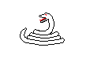
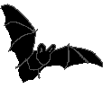

# Dzikie karty

**Jednoosobowa gra karciana typu roguelike deck-builder.**

## Krótki opis
Wcielasz się w rolę zaklinacza zwierząt, który zagubił się w głębokim lesie. Twoim jedynym sposobem na przetrwanie jest walka z napotykanymi po drodze dzikimi zwierzętami. Rozgrywka toczy się w trybie singleplayer, twoim przeciwnikiem jest komputer.

## Cel gry
Głównym celem rozgrywki jest **ucieczka z lasu**. Aby tego dokonać, musisz przetrwać i wygrywać kolejne bitwy.

## Mechanika gry
* Walka opiera się na zagrywaniu kart. Każda karta w grze posiada unikalne statystyki:
    * ❤️ **Punkty życia (HP)**
    * ⚔️ **Atak**
    * ⚡ **Koszt zagrania**

## Postacie w grze

<table>
  <tr>
    <td align="center">
       
      <b>Kruk</b>
    </td>
    <td align="center">
       
      <b>Karaczan</b>
    </td>
    <td align="center">
       
      <b>Wąż</b>
    </td>
    <td align="center">
       
      <b>Wilk</b>
    </td>
    <td align="center">
       
      <b>Nietoperz</b>
    </td>
    <td align="center">
       
      <b>Opos</b>
    </td>
    <td align="center">
       
      <b>Wiewiórka</b>
    </td>
  </tr>
</table>
